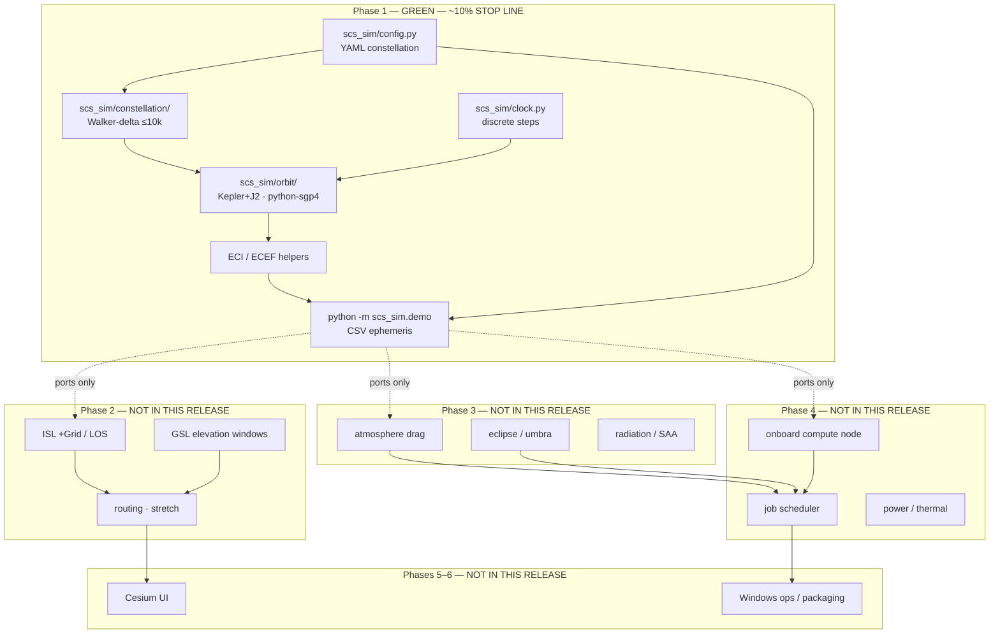

# Architecture — SCS-Sim

**Product:** industrial-grade Starlink-like **compute** constellation simulator  
**Horizon:** fly ~10 000 satellites for orbital insertion, deployment, and operations  
**This document marks Phase 1 as the stop line (~10% of the full product).**

---

## Layered phases



Hexagonal-ish rule: **ports live in each package**; adapters (Kepler+J2, SGP4 today; Orekit / jaxsgp4 / Hypatia-style network later) plug in without rewriting the demo or config.

---

## Module progress

| Module | Phase | Status | Completion | Notes |
|--------|------:|--------|-----------:|-------|
| `scs_sim/config.py` | 1 | **green** | 90% | YAML load + validation |
| `scs_sim/clock.py` | 1 | **green** | 90% | fixed-step UTC clock |
| `scs_sim/orbit/` | 1 | **green** | 85% | Kepler+J2 vectorized; SGP4 adapter |
| `scs_sim/constellation/` | 1 | **green** | 90% | Walker-delta, 10k-capable |
| `scs_sim/demo.py` | 1 | **green** | 95% | CSV + summary |
| `configs/walker_10k.yaml` | 1 | **green** | 100% | 10008 sats; `demo.max_sats` subsample |
| `scs_sim/environment/` | 3 | placeholder | 5% | drag / eclipse / radiation **interfaces only** |
| `scs_sim/network/` | 2 | placeholder | 5% | ISL / GSL **interfaces only** |
| `scs_sim/compute/` | 4 | placeholder | 5% | node + scheduler **interfaces only** |
| Cesium UI | 5 | **not started** | 0% | — |
| Power / thermal models | 3–4 | **not started** | 0% | — |
| ISL routing | 2 | **not started** | 0% | — |
| Ops packaging | 6 | **not started** | 0% | run scripts only |

### Stop line

```
██████████░░░░░░░░░░░░░░░░░░░░░░░░░░░░░░░░░░  10%
^ Phase 1 complete — do not implement Phase 2+ here
```

**Claimed product progress: 10%.**

---

## Runtime data flow (Phase 1)

1. Load `configs/walker_10k.yaml`.
2. Expand each shell with Walker `i : T/P/F` (vectorized numpy).
3. Optionally stride-subsample to `demo.max_sats`.
4. Tick `SimClock` for `N` steps of `dt` seconds.
5. Propagate with `kepler_j2` (default) or `sgp4`.
6. Write ECI + ECEF kilometres to `out/ephemeris_demo.csv`.

No ISL graph, no drag force in the stepper, no job queue.

---

## Why these boundaries

| Later plugin | Port today | Inspiration (clean-room) |
|--------------|------------|--------------------------|
| jaxsgp4 / Orekit | `orbit.PropagatorPort` | python-sgp4, Orekit, poliastro |
| +Grid / routing | `network.ISLTopologyPort` | Hypatia, StarPerf, LEOCraft, LEOPath |
| Event-driven net | same + `SimClock` | DSNS |
| Drag / eclipse | `environment.*Port` | orbital-compute, Orekit force models |
| GPU jobs in orbit | `compute.SchedulerPort` | orbital-compute |

Do **not** vendor-copy GPL trees (Hypatia `ns3-sat-sim`, DSNS). Re-implement APIs.

---

## Scalability note (10k)

Walker generation is `O(N)` numpy with no per-sat Python objects beyond id strings. Kepler+J2 is fully vectorized. SGP4 is a per-sat `Satrec` loop — fine for checks, not the 10k default path.
