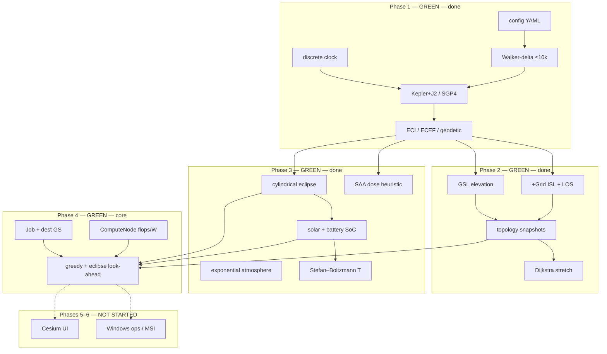

# Architecture — SCS-Sim

**Product:** industrial-grade Starlink-like **compute** constellation simulator  
**Horizon:** fly ~10 000 satellites for orbital insertion, deployment, and operations  
**Out of scope still:** Cesium UI, ops deployment automation, Windows MSI, Orekit adapter.

**Claimed product progress: 50%** (Phases 1–2 done, Phase 3 done, Phase 4 core scheduler).

---

## Layered phases



Hexagonal-ish rule: ports stay in each package. Phase 4 scheduler reads power / eclipse / topology without owning them.

---

## Module progress

| Module | Phase | Status | Completion | Notes |
|--------|------:|--------|-----------:|-------|
| `scs_sim/config.py` | 1–4 | **green** | 95% | constellation + ISL/GSL + power/thermal + jobs |
| `scs_sim/clock.py` | 1 | **green** | 90% | fixed-step UTC clock |
| `scs_sim/orbit/` | 1+3 | **green** | 90% | Kepler+J2; SGP4; optional drag hook |
| `scs_sim/constellation/` | 1 | **green** | 95% | Walker-delta; subsample modes |
| `scs_sim/network/` | 2 | **green** | 90% | +Grid, GSL, snapshots, reachability |
| `scs_sim/environment/` eclipse+atm | 3 | **green** | 90% | cylinder shadow + exponential ρ |
| `scs_sim/environment/` power | 3 | **green** | 90% | solar + SoC ∈ [0,1] |
| `scs_sim/environment/` thermal | 3 | **green** | 85% | lumped SB temperature |
| `scs_sim/environment/` radiation | 3 | **green** | 80% | SAA heuristic + dose |
| `scs_sim/compute/` | 4 | **green** | 90% | node, jobs, greedy look-ahead |
| `scs_sim/demo.py` | 1–4 | **green** | 90% | ephemeris + env + schedule CSVs |
| `configs/phase4_compute.yaml` | 4 | **green** | 100% | 48-sat Walker + 10 jobs |
| Cesium UI | 5 | **not started** | 0% | — |
| Ops packaging | 6 | **not started** | 0% | run scripts only |

### Progress bar (product)

```
████████████████████░░░░░░░░░░░░░░░░░░░░░░░░  50%
Phase 1–3 done · Phase 4 core · no Cesium / ops
```

**Claimed product progress: 50%.**

---

## Runtime data flow (Phase 1–4)

1. Load YAML; expand Walker; subsample.
2. Each clock step: propagate → eclipse/sunlight → topology (optional) → **schedule jobs** (sun, next-step sun, SoC, dest-GS reachability) → tick FLOPs → **battery / thermal / SAA dose**.
3. Write `out/ephemeris_demo.csv`, `out/environment_demo.csv`, `out/topology_demo.json`, `out/compute_schedule.csv`.

---

## Compute scheduler (Phase 4)

| Rule | Behavior |
|------|----------|
| Capacity | `compute.flops` FLOP/s, `idle_w` / `busy_w` |
| Eligibility | not busy; SoC ≥ `min_soc`; if `dest_gs` set, sat must reach that GS (GSL or ISL hops) |
| Score | 3·sun + 2·sun_next + 4·SoC + dest bonus − eclipse penalty |
| Progress | `remaining -= flops * dt`; stall and mark **delayed** if SoC hits 0 |
| Energy | `busy_w * dt` while running |

Inspired by orbital-compute (clean-room). Not a full PHOENIX / multi-resource packer.

---

## Environment (Phase 3)

| Piece | Model |
|-------|--------|
| Eclipse | night-side Earth cylinder + penumbra annulus |
| Power | P_solar = sun · A · η · 1361 W; SoC clip [0,1] |
| Thermal | C dT/dt = α S A_abs sun + Q_int − εσA T⁴ |
| Radiation | SAA Gaussian (lat −25°, lon −50°) + polar horns; dose += flux·dt |
| Drag | optional, off by default |

---

## Scalability

Demo subsample (48–120 sats) for topology + scheduler. Full 10k generation still works; do not run O(N²) fill at N=10008 in the default scripts.
