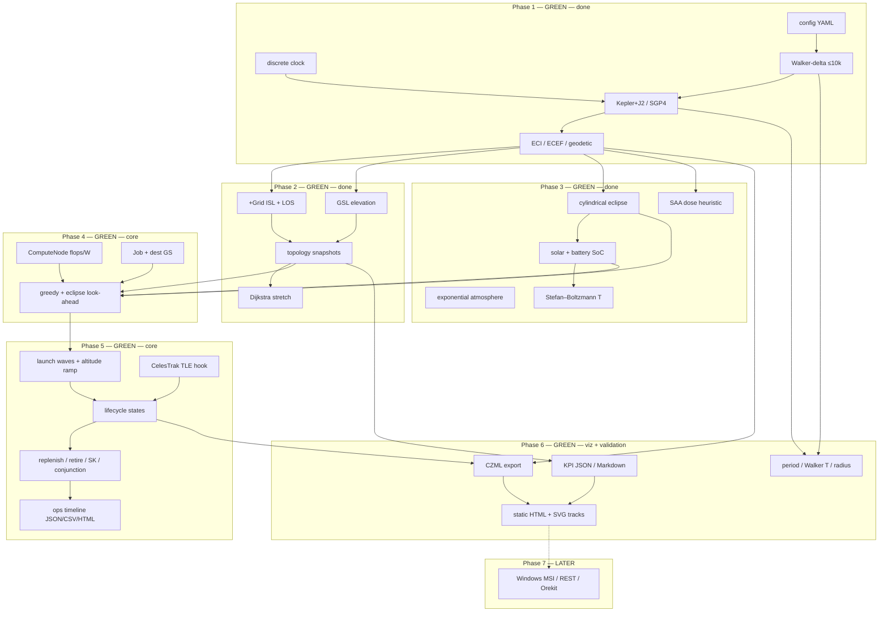

# Architecture — SCS-Sim

**Product:** industrial-grade Starlink-like **compute** constellation simulator  
**Horizon:** fly ~10 000 satellites for orbital insertion, deployment, and operations  
**Out of scope still:** Windows MSI, Orekit adapter, production REST / K8s (Phase 7).

**Claimed product progress: 78%** (Phases 1–5 + Phase 6 CZML / offline viz / validation).

---

## Layered phases



Hexagonal-ish rule: ports stay in each package. Phase 4 scheduler reads power / eclipse / topology without owning them.

---

## Module progress

| Module | Phase | Status | Completion | Notes |
|--------|------:|--------|-----------:|-------|
| `scs_sim/config.py` | 1–6 | **green** | 96% | + viz output paths |
| `scs_sim/clock.py` | 1 | **green** | 90% | fixed-step UTC clock |
| `scs_sim/orbit/` | 1+3 | **green** | 90% | Kepler+J2; SGP4; optional drag hook |
| `scs_sim/constellation/` | 1 | **green** | 95% | Walker-delta; subsample modes |
| `scs_sim/network/` | 2 | **green** | 90% | +Grid, GSL, snapshots, reachability |
| `scs_sim/environment/` eclipse+atm | 3 | **green** | 90% | cylinder shadow + exponential ρ |
| `scs_sim/environment/` power | 3 | **green** | 90% | solar + SoC ∈ [0,1] |
| `scs_sim/environment/` thermal | 3 | **green** | 85% | lumped SB temperature |
| `scs_sim/environment/` radiation | 3 | **green** | 80% | SAA heuristic + dose |
| `scs_sim/compute/` | 4 | **green** | 90% | node, jobs, greedy look-ahead |
| `scs_sim/demo.py` | 1–4 | **green** | 90% | ephemeris + env + schedule CSVs |
| `scs_sim/ops/` | 5 | **green** | 90% | waves, lifecycle, TLE, timeline |
| `scs_sim/demo_ops.py` | 5 | **green** | 90% | insertion / ops demo |
| `configs/phase5_ops.yaml` | 5 | **green** | 100% | 3 waves, ~104 sats |
| `scs_sim/viz/` | 6 | **green** | 90% | CZML, SVG/PNG tracks, HTML, KPI |
| `scs_sim/validation/` | 6 | **green** | 90% | period / T / radius; optional baselines |
| `scs_sim/demo_viz.py` | 6 | **green** | 90% | Phase 6 runner |
| `configs/phase6_viz.yaml` | 6 | **green** | 100% | 6×6 = 36 sats |
| Windows MSI / Orekit | 7 | **not started** | 0% | follow-up |

### Progress bar (product)

```
███████████████████████████████░░░░░░░░░░░░░  78%
Phase 1–5 done · Phase 6 viz + validation · no MSI / Orekit
```

**Claimed product progress: 78%.**

---

## Runtime data flow (Phase 1–4)

1. Load YAML; expand Walker; subsample.
2. Each clock step: propagate → eclipse/sunlight → topology (optional) → **schedule jobs** (sun, next-step sun, SoC, dest-GS reachability) → tick FLOPs → **battery / thermal / SAA dose**.
3. Write `out/ephemeris_demo.csv`, `out/environment_demo.csv`, `out/topology_demo.json`, `out/compute_schedule.csv`.

---

## Compute scheduler (Phase 4)

| Rule | Behavior |
|------|----------|
| Capacity | `compute.flops` FLOP/s, `idle_w` / `busy_w` |
| Eligibility | not busy; SoC ≥ `min_soc`; if `dest_gs` set, sat must reach that GS (GSL or ISL hops) |
| Score | 3·sun + 2·sun_next + 4·SoC + dest bonus − eclipse penalty |
| Progress | `remaining -= flops * dt`; stall and mark **delayed** if SoC hits 0 |
| Energy | `busy_w * dt` while running |

Inspired by orbital-compute (clean-room). Not a full PHOENIX / multi-resource packer.

---

## Environment (Phase 3)

| Piece | Model |
|-------|--------|
| Eclipse | night-side Earth cylinder + penumbra annulus |
| Power | P_solar = sun · A · η · 1361 W; SoC clip [0,1] |
| Thermal | C dT/dt = α S A_abs sun + Q_int − εσA T⁴ |
| Radiation | SAA Gaussian (lat −25°, lon −50°) + polar horns; dose += flux·dt |
| Drag | optional, off by default |

---

## Phase 5 — insertion and operations

| Piece | Behavior |
|-------|----------|
| Waves | `deployment.waves[]`: launch epoch, parking→operational altitude ramp, commission hold |
| States | `planned → ascending → commissioning → operational → decommissioning → retired` |
| Topology | **only `operational`** sats enter the ISL graph |
| Actions | replenish (add parking sats), retire, station-keeping mean-anomaly nudge, conjunction subsample |
| Artifacts | `out/ops_timeline.json`, `out/ops_events.csv`, `out/ops_timeline.html` (static ops table) |

### TLE alignment hook

Set `deployment.tle_path` to a CelesTrak 2-line / 3-line TLE file. `scs_sim.ops.tle` parses blocks and maps mean motion → semi-major axis into `KeplerianBatch`. Those sats attach as **operational** catalog vehicles.

To fly **real Starlink** later:

1. Download `https://celestrak.org/NORAD/elements/gp.php?GROUP=starlink&FORMAT=tle`
2. Point `tle_path` at the file (or a subset).
3. Optionally set `propagator: sgp4` so TEME positions come from python-sgp4 instead of Kepler+J2.
4. Waves can still insert **new** synthetic sats beside the catalog.

No network fetch is performed by the sim.

---

## Phase 6 — visualization and validation

| Piece | Behavior |
|-------|----------|
| CZML | `out/constellation.czml` from propagator geodetic samples; optional last-snapshot ISL/GSL lines. **No Cesium key at generation.** |
| Viewer | `out/viz_globe.html` embeds SVG tracks; CesiumJS CDN is optional (Natural Earth II, no Ion token). PNG via optional matplotlib. |
| KPI | `out/kpi_dashboard.json` + `out/kpi_report.md`: GS-with-link coverage, ISL degree, stretch histogram, job completion, fleet SoC |
| Validation | Kepler period, Walker T, radius ≈ a; Hypatia RTT / LEOCraft stretch **skip** if `tests/baselines/` files are absent |

See [docs/VIZ.md](VIZ.md) and [docs/VALIDATION.md](VALIDATION.md).

---

## Scalability

Demo subsample (36–120 sats) for topology + scheduler + viz. Phase 5 default is ~104 wave sats; Phase 6 default is 36. Full 10k generation still works via `walker_10k.yaml`; do not run O(N²) fill at N=10008 in the default scripts.
