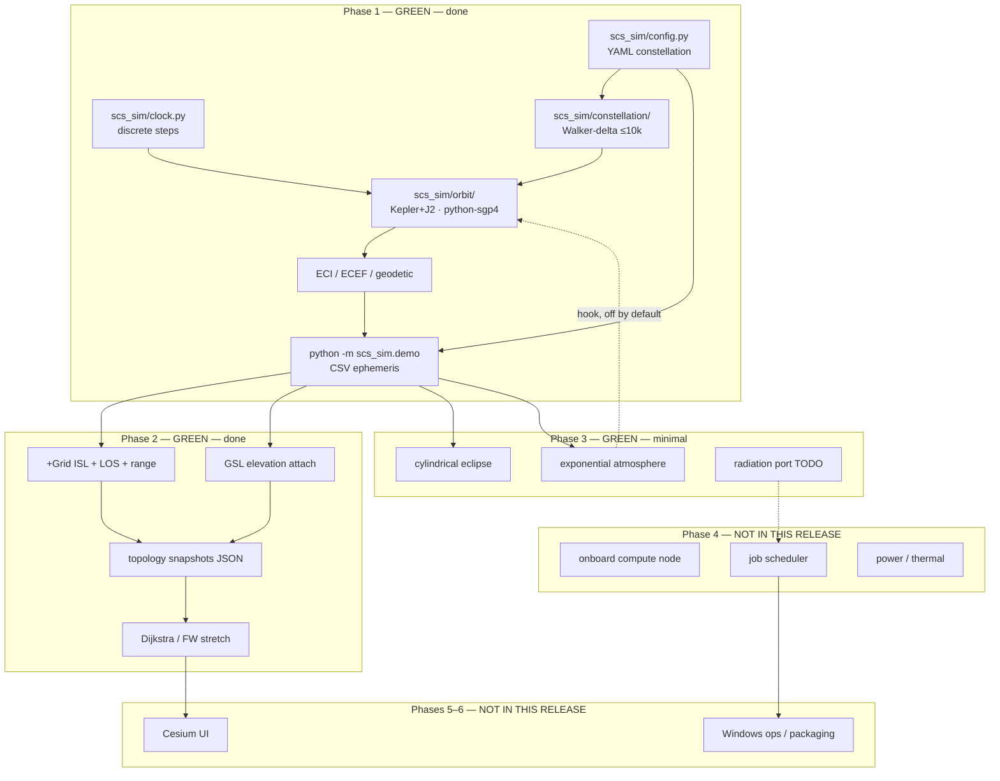

# Architecture — SCS-Sim

**Product:** industrial-grade Starlink-like **compute** constellation simulator  
**Horizon:** fly ~10 000 satellites for orbital insertion, deployment, and operations  
**Quota stop:** keep going through Phase 2–3 in this increment; **do not start Cesium / compute scheduler / ops (Phases 4–6).**

**Claimed product progress: 32%** (Phase 1 done + Phase 2 done + Phase 3 minimal physics).

---

## Layered phases



Hexagonal-ish rule: **ports live in each package**; adapters (Kepler+J2, SGP4, +Grid, cylindrical eclipse) plug in without rewriting the demo.

---

## Module progress

| Module | Phase | Status | Completion | Notes |
|--------|------:|--------|-----------:|-------|
| `scs_sim/config.py` | 1–3 | **green** | 95% | YAML + ISL/GSL/GS/environment |
| `scs_sim/clock.py` | 1 | **green** | 90% | fixed-step UTC clock |
| `scs_sim/orbit/` | 1+3 | **green** | 90% | Kepler+J2; SGP4; optional drag hook |
| `scs_sim/constellation/` | 1 | **green** | 95% | Walker-delta; first_shell subsample |
| `scs_sim/demo.py` | 1–3 | **green** | 90% | CSV + topology + eclipse columns |
| `configs/walker_10k.yaml` | 1–3 | **green** | 100% | 10008 sats + GS + ISL |
| `configs/phase2_network.yaml` | 2 | **green** | 100% | complete 12×10 Walker |
| `scs_sim/network/` | 2 | **green** | 90% | +Grid, GSL, snapshots, routing |
| `scs_sim/environment/` eclipse+atm | 3 | **green** | 75% | cylindrical shadow + exponential ρ |
| `scs_sim/environment/` radiation | 3 | placeholder | 5% | **still TODO** |
| `scs_sim/compute/` | 4 | placeholder | 5% | node + scheduler **interfaces only** |
| Cesium UI | 5 | **not started** | 0% | — |
| Power / thermal models | 4 | **not started** | 0% | — |
| Ops packaging | 6 | **not started** | 0% | run scripts only |

### Progress bar (product)

```
█████████████░░░░░░░░░░░░░░░░░░░░░░░░░░░░░░░  32%
Phase 1 done · Phase 2 done · Phase 3 minimal
Quota stop ≈ 10% of Cursor/Grok Bot usage — not a product-phase freeze
```

**Claimed product progress: 32%.**

---

## Runtime data flow (Phase 1–3)

1. Load YAML (`walker_10k.yaml` or `phase2_network.yaml`).
2. Expand Walker shells; subsample (`spread_planes` on the 10k demo keeps intra-plane +Grid and global GS coverage; `first_shell` / `stride` also supported).
3. Tick `SimClock`; propagate Kepler+J2 (drag off by default).
4. Write ECI/ECEF (+ optional eclipse / density) to `out/ephemeris_demo.csv`.
5. On topology steps: +Grid ISL (LOS + max range) + GSL elevation attach.
6. Dijkstra GS↔GS: hop count and path-length / geodesic **stretch**.
7. Write `out/topology_demo.json` and `out/topology_edges.csv`.

No compute job queue, no Cesium, no radiation maps.

---

## Network model (Phase 2)

| Piece | Rule |
|-------|------|
| +Grid candidates | same shell: intra-plane slot ±1, inter-plane plane ±1 (wrap P/S) |
| Feasible ISL | range ≤ `isl.max_range_km` and chord misses the Earth sphere |
| Geometric fill | if `fill_geometric`, top up each sat to `max_degree` nearest LOS+range |
| GSL | WGS-84 GS; elevation ≥ `gsl.min_elevation_deg`; attach `max_attach` nearest |
| Routing | undirected weighted graph (range_km); Dijkstra; FW available for tests |

Clean-room APIs inspired by Hypatia, StarPerf, LEOCraft, LEOPath — not vendored.

---

## Environment model (Phase 3)

| Piece | Status |
|-------|--------|
| Sun vector | low-precision Meeus mean longitude |
| Eclipse | night-side cylinder radius Rₑ (umbra) + solar-angle penumbra |
| Atmosphere | ρ = ρ_ref exp(−(h−h_ref)/H); cannonball drag accel |
| Drag on orbit | `environment.apply_drag` first-order *a* decay — **off by default** |
| Radiation | `NullRadiation` only — TODO |

---

## Why these boundaries

| Later plugin | Port today | Inspiration (clean-room) |
|--------------|------------|--------------------------|
| jaxsgp4 / Orekit | `orbit.PropagatorPort` | python-sgp4, Orekit, poliastro |
| richer routing | `network` graph | Hypatia, StarPerf, LEOCraft, LEOPath |
| Event-driven net | same + `SimClock` | DSNS |
| MSIS / conical shadow | `environment.*Port` | orbital-compute, Orekit |
| GPU jobs in orbit | `compute.SchedulerPort` | orbital-compute |

Do **not** vendor-copy GPL trees (Hypatia `ns3-sat-sim`, DSNS).

---

## Scalability note (10k)

Walker generation and Kepler+J2 stay vectorized. Topology uses O(N²) geometric fill only on the **demo subsample** (default 100, or 120 on `phase2_network.yaml`). Full 10k adjacency is a later ops concern.
